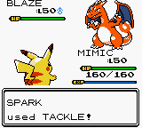
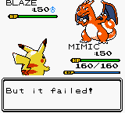
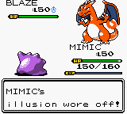
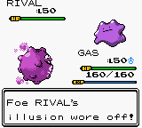
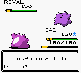

# Implement Illusion

Illusion now disguises a battler as the last living, non-Egg member of its party.
The disguise is chosen before send-out text and graphics, remains fixed until
revealed or withdrawn, and never changes the battler's species, types, stats,
moves, HP or party nickname.

## Behavior

- Adds the **Illusion** ability, its description and ability-interaction flags.
- Stores a one-based party slot separately for each side. A single-member party,
  or a battler that is itself the last eligible member, gets no disguise.
  Reviving a later party member does not change the stored target; switching
  back in selects a new target.
- Direct attack damage reveals Illusion before healing items and subsequent
  hits. Zero damage and hits absorbed by Substitute do not reveal it. Poison,
  burn, hazards, recoil and confusion/self-damage leave it intact.
- Neutralizing Gas blocks activation and dismisses an existing disguise when
  its user enters, including when that user subsequently faints to hazards.
  Gas leaving does not reactivate Illusion. A transformed Gas user cannot
  suppress it.
- Transform and Imposter fail against an active disguise. Transform works after
  reveal, ends the user's own disguise when successful, and cannot give a
  transformed Pokémon an active Illusion. Trace, ability copying and Skill Swap
  cannot acquire/swap Illusion; Mold Breaker does not bypass its presentation.
- Both battle pictures, cries and sprite palettes use the disguise, including
  its form, shininess and DV color variation. Shared picture reload paths keep
  the disguise through menu returns and Substitute animations.
- Battle text uses the apparent nickname, including send-outs, withdrawal,
  move messages, the opponent's switch preview and the active battler's
  experience, item-use and move-learning messages. The player's HUD keeps its
  **true nickname**. The enemy HUD uses the apparent nickname, gender and shiny
  marker. HP, level and
  status remain the actual battler's values.

## Implementation and compatibility

`engine/battle/illusion.asm` owns target selection, appearance lookup, nickname
restoration and revelation. The switch preview shares the selector without
activating or modifying either battler's disguise. Illusion activates only in
the send-in path, rather than the repeatable entry-ability table, so ability
refreshes cannot silently recreate or retarget it.

Battle nickname buffers represent the names spoken in battle; party nickname
storage remains authoritative for the player's HUD. In-battle evolution
refreshes the apparent name after reloading the battler. Attack damage uses the
existing attack-only damage path, keeping residual damage handling separate.

Two previously unused, unsaved WRAM bytes hold the targets. **No existing RAM
symbols moved, and no save patch is required.** The ability ID is appended, so
existing ability IDs retain their values. The standard build adds 598 ROM bytes
and retains 13,430 bytes of free space.

No production species' ability sets change. This Pokédex has no Zorua or
Zoroark, and assigning Illusion to another species would add a balance decision
to the engine feature. The reproducible test fixture temporarily assigns it to
Ditto in the emulator's private ROM image. Those assignments are not written to
the ROM file or included in the shipped base-stat tables.

## Monochrome build repair

Testing also exposed two pre-existing palette table errors in the monochrome
build: the judge-machine cycle emitted four colors per entry where its consumer
expects two, and the individual sprite-palette table omitted the four Aqua
palettes. This branch corrects the entry width and restores those four entries,
allowing the monochrome build and Illusion tests to run. Normal-color palette
data is unchanged.

## Validation

- RGBDS 1.0.4 builds: standard; faithful + debug; faithful + debug + Virtual
  Console (including the VC patch); monochrome.
- 22 compiled-ROM regression tests per validated ROM, including 728 party
  configurations: target selection on both sides, names and
  immutable battle identity, Revive, attack/residual damage, Substitute,
  lethal damage, Mold Breaker, Gas activation/deactivation, Transform,
  ability flags, battle reset and appearance/palette selection.
- Rendered integration scenarios on standard and monochrome execute complete
  send-outs, assert actual HUD and message tiles, and exercise attack reveal,
  a Gas switch-in, failed
  Transform against a disguise and successful Transform after reveal.
- `python3 utils/optimize.py`: zero findings before and after the change.
- `git diff --check`: clean. Existing WRAM, HRAM and SRAM symbols compared
  against the baseline: zero address changes.
- Reviewed new/changed routine call sites and register preservation against
  `CONTRIBUTIONS.md` and the linked assembly optimization guidance.

Reproduction commands and test boundaries are in
[tests/README.md](../../tests/README.md). The tests exercise each battle side
locally; a two-emulator link session and a full story playthrough are outside
this validation.

## Screenshots

These are native screenshots from the standard built ROM, generated by
`tests/illusion_screenshots.py`; both Illusion users are Ditto in the fixture.

| Both disguises and move text | Transform blocked |
| --- | --- |
|  |  |

| Attack reveals the player | Gas reveals the enemy |
| --- | --- |
|  |  |

## Short video clips

Silent emulator recordings, 640×576 at 60 fps with nearest-neighbor scaling.
These use the same deterministic fixtures and assertions as the screenshots;
move choices and damage are supplied by the harness. Every frame comes from
the game renderer. Each clip ends with a two-second reading pause.

- [Disguised send-outs and apparent-name text](clips/01-disguises.mp4) — about 8 seconds.
- [Transform fails against a disguise](clips/02-transform-blocked.mp4) — about 4 seconds.
- [Attack damage reveals the player](clips/03-attack-reveal.mp4) — about 5 seconds.
- [Neutralizing Gas enters and reveals the enemy](clips/04-gas-reveal.mp4) — about 5 seconds.
- [Transform succeeds after revelation](clips/05-transform-after-reveal.mp4) — about 6 seconds.
